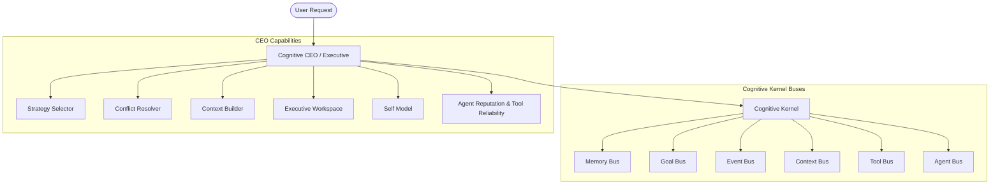

# Kattappa Cognitive OS Architecture

This document tracks the core architectural layout of the **Kattappa Cognitive Operating System (COS)**.

---

## 1. System Layout

To eliminate $O(N^2)$ direct component coupling, all subsystems are routed through the central **Cognitive Kernel** and managed by the **Cognitive CEO**.

---

## 2. Kernel & Bus Coordination

- **MemoryBus**: Wraps and abstracts `SemanticMemory`, `EpisodicMemory`, `ProceduralMemory`, and the SQLite-backed `SleepBuffer`.
- **ContextBus**: Interfaces with the `ContextManager` to generate unified compressed contexts.
- **EventBus**: Publisher-subscriber engine wrapping `BLACKBOARD` events.
- **GoalBus**: Coordinates hierarchical task creation, completion state checks, and updates.
- **ToolBus**: Executes tool requests and records outcomes inside the `ToolReliabilityTracker`.
- **AgentBus**: Registry for sub-agent definitions, capability profiles, and scheduler triggers.

---

## 3. Core Working Registers (`ExecutiveWorkspace`)

Exposes thread-safe active registers:
- `scratchpad`: key-value transient values.
- `reasoning_stack`: stack of active sub-reasoning tasks.
- `thought_queue`: queue of intermediate ideas/observations.
- `active_hypotheses`: active candidate experiments.
- `registers`: fast-access execution states.

---

## 4. Conflict Resolution Hierarchy

Whenever specialists propose clashing strategies, the **Conflict Resolver** arbitrates:
$$\text{Wisdom (Ethics)} > \text{World Model Risk} > \text{Scientist Evidence} > \text{Planner Strategy}$$
- Wisdom: blocks unethical proposals.
- Safety Risk: halts ($\ge 0.85$) or gates ($\ge 0.50$) planning.
- Scientist Evidence: degrades plan confidence if proof is below threshold ($P < 0.95$).
- Planner: guides tactical execution.
