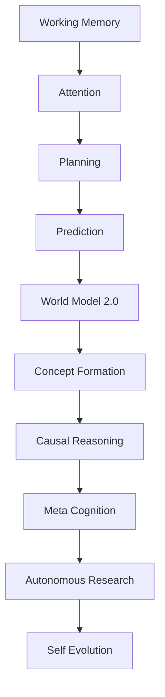

# Capability Dependency Graph

This document tracks the topological dependencies across Kattappa's cognitive capabilities, preventing advanced subsystems from being built on immature foundations.

---

## 1. Topological Graph Layout

---

## 2. Dependency Registry

- **World Model 2.0 (K21)**:
  - *Prerequisites*: `Working Memory` (Registers), `Prediction` (Predictive Engine).
  - *Unlocks*: `Concept Formation`, `Causal Reasoning`.
- **Causal Reasoning (K23)**:
  - *Prerequisites*: `World Model 2.0`, `Concept Formation`.
  - *Unlocks*: `Meta Reasoner`, `Curiosity Engine`.
- **Self Evolution (K30)**:
  - *Prerequisites*: `Causal Reasoning`, `Autonomous Research`.
  - *Unlocks*: `Recursive Self Improvement`.
