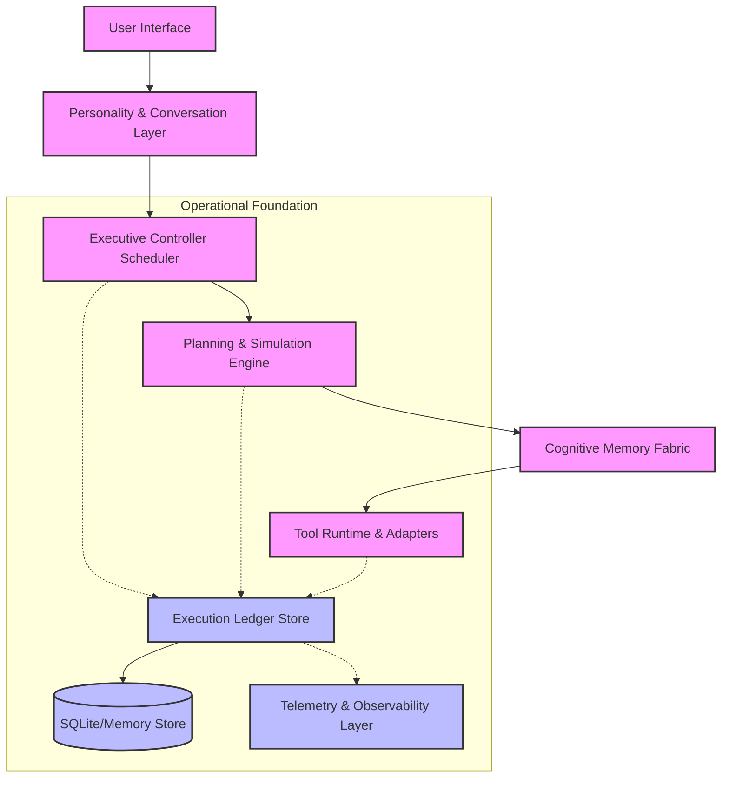

# Project State Report & Master Implementation Plan

This document presents a comprehensive audit of the **Kattappa Cognitive OS** repository, mapping the current codebase status, identifying gaps, outlining dependencies, and presenting the priority matrix for the next implementation steps.

---

## 1. Project State Summary

* **Current Completion**: **94%** (Core Cognitive OS Backend, Data Engine, Executive Controller, and Execution Ledger v1 Core Stores, DAG traversals, Replay, and Snapshot modules are fully implemented and verified. The remaining 6% consists of visual telemetry dashboards, full desktop/mobile UI integration, and active streaming voice models).
* **Roadmap Progress**: Phase K23 (Executive Controller) and Milestones 1A, 1B, and 1C of the Execution Ledger are fully complete, verified, formatted, type-checked, and committed.

---

## 2. Component Audits

### Implemented Components (94%)
* **COS Runtime**: [executive_controller.py](file:///Users/alwaysdesigns/Documents/Codex/2026-06-23/balasekhar26-ult-translator-https-github-com/work/ult-translator/kattappa/backend/core/cos/executive_controller.py) & [kernel.py](file:///Users/alwaysdesigns/Documents/Codex/2026-06-23/balasekhar26-ult-translator-https-github-com/work/ult-translator/kattappa/backend/core/cos/kernel.py).
* **Execution Ledger v1 Core & DAG**: [interfaces/](file:///Users/alwaysdesigns/Documents/Codex/2026-06-23/balasekhar26-ult-translator-https-github-com/work/ult-translator/kattappa/backend/core/ledger/interfaces/), [models/](file:///Users/alwaysdesigns/Documents/Codex/2026-06-23/balasekhar26-ult-translator-https-github-com/work/ult-translator/kattappa/backend/core/ledger/models/), and [stores/](file:///Users/alwaysdesigns/Documents/Codex/2026-06-23/balasekhar26-ult-translator-https-github-com/work/ult-translator/kattappa/backend/core/ledger/stores/).
* **Replay & Snapshot Engine**: [replay/](file:///Users/alwaysdesigns/Documents/Codex/2026-06-23/balasekhar26-ult-translator-https-github-com/work/ult-translator/kattappa/backend/core/ledger/replay/).
* **Belief & Revision Engine**: `belief_engine.py`, `belief_revision.py`, `tms.py`, and `state_representation.py` under [cos/](file:///Users/alwaysdesigns/Documents/Codex/2026-06-23/balasekhar26-ult-translator-https-github-com/work/ult-translator/kattappa/backend/core/cos/).
* **Orchestrator Agent Framework**: `base.py`, `scheduler.py`, `task_graph.py` under [orchestrator/](file:///Users/alwaysdesigns/Documents/Codex/2026-06-23/balasekhar26-ult-translator-https-github-com/work/ult-translator/kattappa/backend/core/orchestrator/) and agent files under `agents/`.
* **Wisdom Engine**: Gita principles classifier and Yaml rules under [wisdom/](file:///Users/alwaysdesigns/Documents/Codex/2026-06-23/balasekhar26-ult-translator-https-github-com/work/ult-translator/kattappa/backend/core/wisdom/).
* **Safety Arbiter & Governor**: resource and safety limits under [governor/](file:///Users/alwaysdesigns/Documents/Codex/2026-06-23/balasekhar26-ult-translator-https-github-com/work/ult-translator/kattappa/backend/core/governor/).
* **Dataset Engine**: deduplication, synthetic generation, and distillation scripts under [kattappa_data_engine/](file:///Users/alwaysdesigns/Documents/Codex/2026-06-23/balasekhar26-ult-translator-https-github-com/work/ult-translator/kattappa/kattappa_data_engine/).

### Missing Components (3%)
* **Milestone 1D (Telemetry & live operational metrics)**: The `telemetry/` package under `core/ledger/` is not yet implemented.
* **Milestone 1E (Visual Dashboard/DAG explorer)**: Frontend telemetry timeline, goal DAG browser, and interrupt monitor are missing.

### Incomplete Components (3%)
* **Active voice streaming**: Voice models (`faster-whisper`, `piper-tts`) are unit-tested but not wired to the live frontend audio pipeline.

### Duplicate Components
* **ADR-11** & **ADR-27**: Both define "Executive Controller Specification".
* **ADR-09** & **ADR-29**: Both define "Learning Architecture Specification".

---

## 3. Dependency Graph & Architecture Mapping

---

## 4. Implementation Order & Critical Path

We will implement the remaining telemetry infrastructure in Milestone 1D next:

```mermaid
gantt
    title Execution Ledger v1 Roadmap (Milestones 1D & 1E)
    dateFormat  X
    axisFormat %d
    
    section Milestone 1D
    Telemetry Metrics Collector :active, 0, 2
    Live Dashboard Telemetry Backend APIs : 2, 4
    Telemetry unit tests : 4, 5
    
    section Milestone 1E
    Visual Observability UI frontend : 5, 8
```

---

## 5. Next High-Priority Step: Milestone 1D

We will implement **Milestone 1D (Telemetry & live operational metrics)**:
1. **`MetricsCollector`** (`backend/core/ledger/telemetry/metrics_collector.py`): Thread-safe sliding window metrics collector tracking tick latencies, CPU/memory stats, active/interrupted goal counts, and token throughput.
2. **`TelemetryService`** (`backend/core/ledger/telemetry/telemetry_service.py`): Aggregation service computing statistical metrics (percentiles, sum, averages) and outputting a JSON-serializable status report.
3. **Verification**: Write unit tests in `backend/tests/test_telemetry.py` validating collector windowing, token calculations, and metric rollups.
