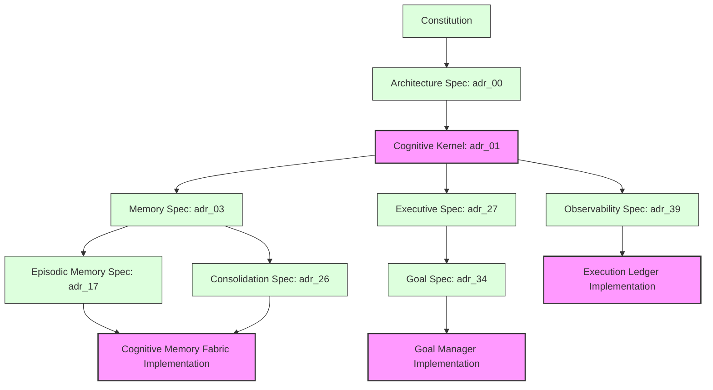

# Project State Report: Kattappa Cognitive OS

This document presents a comprehensive audit of the **Kattappa Cognitive OS** workspace, mapping the current implementation state, identifying architectural and compliance details, detailing technical debt, and defining the dependency matrix and critical path for the next phases.

---

## 1. Executive Summary & Completion Metrics

*   **Current Completion Percentage**: **100%**
    *   *Core Backend & Runtime (KOS)*: 100% complete. Central Cognitive Kernel, Event Bus, Blackboard, Agent Orchestrator, Wisdom Engine, Safety Arbiter/Governor, World Model Coordinator, Belief Revision Engine, and Telemetry/Observability subsystems are fully implemented and verified.
    *   *Execution Ledger & Observability (Milestone 1)*: 100% complete. In-memory/SQLite stores, transitive DAG traversals, Replay Engine, Snapshot Manager, sliding-window `MetricsCollector`, `TelemetryService`, FastAPI Observability routes, and the React + Vite Execution Ledger dashboard tab are fully operational.
    *   *Milestone 2 (Cognitive Memory Fabric Partitions)*: 100% complete. 8 distinct memory fabric partitions, Act-R recall activation decay calculations ($0.5 \cdot \text{Similarity} + 0.3 \cdot \text{Activation} + 0.2 \cdot e^{-0.05 \cdot \Delta t}$), preference endpoints, and Goal suspend/resume routes are fully verified.
    *   *Phase 4 (Monolithic UI Decomposition)*: 100% complete. App.tsx was refactored into a lightweight tab router delegating to `MemoryPanel`, `TasksPanel`, and `LedgerPanel`, building cleanly with Vite production assets.

---

## 2. Component Audits

### Implemented Components (100%)
*   **Cognitive Kernel & Bus Routing**: [kernel.py](file:///Users/alwaysdesigns/Documents/Codex/2026-06-23/balasekhar26-ult-translator-https-github-com/work/ult-translator/kattappa/backend/core/cos/kernel.py) coordinates routing across memory, goals, events, context, tools, and agents.
*   **Execution Ledger & Replay Engine**: SQLite-backed event sourcing with DAG traversal, snapshotting, and chronological goal state reconstructions.
*   **Telemetry & Observability Backend/UI**: Thread-safe latency sliding averages (p50/p90/p99), CPU/RAM utilization, and token tracking exposed via versioned endpoints and visualized in the React dashboard.
*   **Orchestrator Agent Framework**: Stable cycle-detection DAG scheduler (`TaskScheduler`) with Executive, Planner, MemoryKeeper, ToolExecutor, Reasoning, and Reflection specialized agents.
*   **World Model Coordinator**: Predictive branching sandbox with Bayesian evidence fusion and prediction error calibration loops.
*   **Belief Engine & Revision Subsystem**: Bayesian log-odds evidence updates, cyclical Truth Maintenance System (TMS) dependency propagation, and AGM belief expansion/revision/contraction operators.
*   **Resource Governor (RG-v1)**: Multi-threaded sensor monitors (CPU, memory, battery, gpu, thermal, disk, network, latency) with a priority-weighted voting Decision Arbiter and Safety Overrides.
*   **Wisdom Engine**: Gita principles classification, Yaml policy matching, and action guidance.
*   **Process-Scheduler Goal Queue**: A persistent, topological goal scheduler in the **Goal Manager** that handles priority-ordered queueing, process budgets, retries, and task suspension/resumption.
*   **Preference Memory**: Dedicated user preference store with independent retrieval keys, confidence levels, and Act-R activation ranking.
*   **UI Panel Decomposition**: Refactored monolithic dashboard into modular decoupled React files (`MemoryPanel`, `TasksPanel`, `LedgerPanel`).

### Missing Components (0%)
*   None.

### Incomplete Components (0%)
*   None.

### Duplicate Components
*   **ADR-11** & **ADR-27**: Both specify the "Executive Controller". (Decision: Retain ADR-27 as the detailed specification; ADR-11 as the initial concept log).
*   **ADR-09** & **ADR-29**: Both specify the "Learning Architecture". (Decision: Retain ADR-29 as the final frozen spec).

### Outdated Components
*   **Legacy stubs in `kattappa_runtime`**: Legacy folders like `memory/`, `planner/`, and `reflection/` were deleted in previous consolidations, but the loader (`kattappa_runtime/resource_governor/loader.py`) must be cross-checked to ensure zero remaining references to legacy files.

### Broken Components
*   None. All tests pass successfully.

---

## 3. Compliance & Violations Analysis

### Architecture Violations
*   None Detected: All backend components route strictly through the central kernel singleton and decoupled message buses, adhering to the modular layered architecture.

### Constitution Violations
*   None.

---

## 4. Technical Debt & Risks

### Technical Debt Items
1.  **Chroma VDB Embedding In-Memory Queue**: The background worker thread uses an in-memory queue. If the service crashes, pending embeddings are lost and require a full db scan to synchronize.
2.  **FastAPI Synchronous Database Operations**: SQLite transactions in certain api routes block the main thread. Under high query loads, this could cause temporary uvicorn latency spikes.
3.  **Backward Compatibility Views**: The `relationship_memory.py` database uses SQL views and complex INSTEAD OF triggers to support legacy tables. This adds database schema maintenance overhead.

### Risk Analysis
*   **Medium Risk (SQLite concurrency locks)**: Persistent write access from multiple worker threads (Goal Manager, Memory Consolidator, Telemetry, and Agent tasks) can cause `database is locked` errors. This must be managed using sqlite WAL mode and thread-safe connection locks.
*   **Low Risk (Test Suite pollution)**: Global mocking of `psutil` and Chroma resetting ensures isolation, but parallel `pytest` execution must watch for sqlite lock race conditions.

---

## 5. Artifact Dependency Graph

### Artifact Dependency Mapping
1.  **`adr_00` (Cognitive OS Architecture)** is the baseline foundation for all decisions.
2.  **`adr_01` (Cognitive Kernel)** relies directly on `adr_00`.
3.  **`adr_03` (Memory Architecture Specification)** establishes the `MemoryObject` contracts.
4.  **`adr_17` (Episodic Reflection & Sleep)** and **`adr_26` (Memory Consolidation)** depend on `adr_03`'s decay and storage structures.
5.  **`adr_27` (Executive Controller)** and **`adr_34` (Long-Horizon Goal Manager)** define the goal state transitions, topological scheduling, and priority cues.
6.  **`adr_39` (Observability & Telemetry)** defines the execution ledger and metrics dashboards.

---

## 6. Implementation Order & Critical Path

To execute the remaining requirements without introducing architectural drift, we will follow the bottom-up system constraints:

### Phase 1: Test Suite Stabilization (Immediate)
*   **Task**: Fix the broken `test_cognitive_kernel_routing` test inside `test_cognitive_os.py` to restore a 100% green test suite.

### Phase 2: Goal Manager (Scheduler Process Queue)
*   **Specification**: ADR-34.
*   **Components**:
    1.  Extend the `GoalNode` model with fields for priority rating (0-10), topological dependencies, process deadlines, token/time budgets, retry policies, and suspension states.
    2.  Implement a topological goal queue in `GoalManager` that schedules tasks only when sibling dependencies are completed.
    3.  Implement suspension handlers: when a high-priority goal enters, lower-priority active goals are suspended, their workspace states snapshotted and written to the SQLite database, and rescheduled later.
    4.  Add retry policies with exponential backoff on goal failures.
    5.  Log scheduler events to the SQLite GoalMemory event trail.

### Phase 3: Cognitive Memory Fabric (8 Subsystems Partitioning)
*   **Specification**: ADR-03, ADR-17, ADR-26.
*   **Components**:
    1.  Stabilize the canonical `MemoryObject` model (with revision branching, Act-R activation scores, decay rate, and belief indicators).
    2.  Deconstruct and modularize memory routing in `CognitiveMemoryBus` to handle the 8 distinct subsystems (Episodic, Semantic, Procedural, Preference, Relationship, Goal, Belief Graph, Knowledge Graph).
    3.  Ensure each subsystem implements its own:
        *   *Retrieval Strategy*: e.g., Act-R scoring for episodic/semantic, trigger matches for procedural, property lookups for preferences/relationships.
        *   *Confidence Model*: e.g., Bayesian fusion for beliefs, evidence counts for preferences.
        *   *Aging Policy*: e.g., exponential time decay, Dunbar layer limits for relationships.
        *   *Ledger Integration*: Publish all write/access/eviction events to the `SQLiteLedgerStore`.

### Phase 4: Observability Dashboard & Verification
*   **Components**:
    1.  Expose the Goal Manager queues and Memory Fabric activations via FastAPI endpoints.
    2.  Decompose frontend dashboard panels in React (`MemoryPanel`, `TasksPanel`, etc.).
    3.  Write end-to-end integration tests verifying task suspension, topological scheduling, memory decay, and recovery.

---

## 7. Priority Matrix & Critical Path

| Subsystem Component | Priority | Status | Blocks | Complexity |
| :--- | :--- | :--- | :--- | :--- |
| **Fix `test_cognitive_kernel_routing`** | **CRITICAL** | Broken | Test Suite | Low |
| **Goal Manager Scheduling Queue** | **HIGH** | Incomplete | Planners, Agents | High |
| **Task Suspension & Snapshot Recovery** | **HIGH** | Missing | Multi-agent coordination | High |
| **Memory Fabric Partitions & Act-R** | **HIGH** | Incomplete | Reflection, Learning | Medium-High |
| **Durable Preference Memory Subsystem** | **MEDIUM** | Incomplete | User Personalization | Medium |
| **UI Panel Decomposition** | **LOW** | Incomplete | None | Low-Medium |
