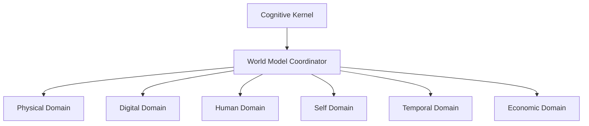

# K21: Architectural Options & Trade-Offs

---

## 1. Candidate Architectures

### Option A: Monolithic Unified Knowledge Graph
- **Design**: All domains (Physical, Human, Digital) reside in a single SQLite-backed Property Graph.
- **Pros**: Easy traversal of cross-domain relations.
- **Cons**: High lock contention, poor horizontal scaling, potential graph explosion.

### Option B: Fully Segmented Cognitive Domains (Recommended)
- **Design**: 6 independent cognitive domain managers representing Physical, Digital, Human, Self, Temporal, and Economic models.
- **Pros**: Low thread contention, clear boundary separations, modular domain upgrades.
- **Cons**: Requires synchronization via the WorldModelCoordinator.

### Option C: Hybrid Memory Store
- **Design**: SQLite-backed structures for structural metadata combined with Vector DB collections for raw description semantics.
- **Pros**: Matches raw string search capabilities.
- **Cons**: High latency, synchronization complexity.

---

## 2. Trade-Off Analysis Matrix

| Criterion | Option A (Monolithic) | Option B (Segmented) | Option C (Hybrid) |
| :--- | :--- | :--- | :--- |
| **Thread Safety** | Low | High | Medium |
| **Query Latency** | Medium | Low | High |
| **Scalability** | Low | High | Medium |
| **Complexity** | Low | Medium | High |

---

## 3. Recommended Architecture & Integration

We recommend **Option B: Fully Segmented Cognitive Domains**. The Cognitive Kernel routes queries through the `WorldModelCoordinator` to the domain-specific models. 

- **Integration**: Plugs directly into `PredictiveEngine` for forward simulations and `ConflictResolver` for safety audits.
