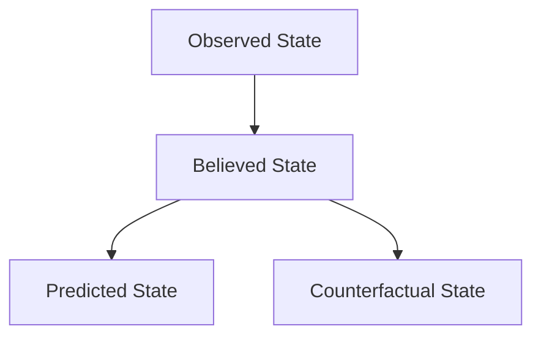

# K21-07: State Representation Specification

This document defines the mathematical and conceptual models for representing states within the Unified Hierarchical Probabilistic World Model.

---

## 1. State Categories

Kattappa separates objective reality (or what has been directly observed) from internal beliefs and speculative simulations. The state of any object in the world model is represented in four tiers:

### 1. Observed State ($S_{obs}$)
- **Description**: The state variables directly measured or observed via tools, sensors, or user inputs.
- **Characteristics**: Immutable historical entries logged with a verified timestamp.

### 2. Believed State ($S_{bel}$)
- **Description**: The system's current estimate of the true world state, derived by integrating past observations with probability models.
- **Characteristics**: Updated dynamically; includes decay over time when observations are sparse.

### 3. Predicted State ($S_{pred}$)
- **Description**: The forecasted future state of objects resulting from simulated plan steps.
- **Characteristics**: Stored on future branches; carries accumulated uncertainty.

### 4. Counterfactual State ($S_{cf}$)
- **Description**: "What-if" states representing alternative realities (e.g. "Suppose database is offline").
- **Characteristics**: Isolated sandboxed copies; discarded immediately after analysis.

---

## 2. Uncertainty Parameters

Every property value in a state carries explicit uncertainty parameters:
$$\text{Property State} = \langle \text{Value}, \text{Confidence}, \text{Variance}, \text{Source}, \text{Timestamp} \rangle$$

- **Confidence ($C \in [0, 1]$)**: Subjective probability that the value is correct.
- **Variance ($\sigma^2$)**: Spread of expectations for continuous numeric attributes.
- **Entropy ($H$)**: Measure of information disorder/unpredictability based on missing values:
  $$H(X) = - \sum_{i=1}^n P(x_i) \log_2 P(x_i)$$
- **Source**: Verification origin (e.g. `direct_tool`, `user_assertion`, `bayesian_inference`).
