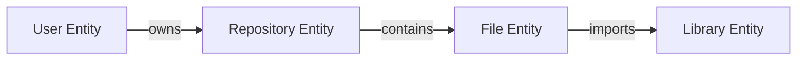

# K21-08: Universal Entity Model

This document specifies the data structure and schema definition for Entities within Kattappa's World Model.

---

## 1. Schema Specification

Every object (file, server, human, processor, goal) inherits from a universal `Entity` model:

```python
@dataclass
class Entity:
    entity_id: str             # Permanent UUIDv4
    entity_type: str           # E.g. 'file', 'user', 'process', 'cpu'
    properties: Dict[str, Any] # Key-value property mapping (contains Value, Confidence, etc.)
    relations: List[Relation]  # Semantic directed connections
    history: List[EventLog]    # Change event ledger
    confidence: float          # Global entity validity score
    last_observed: float       # Unix timestamp of last measurement
    causal_rules: List[str]    # Reference IDs of causal laws governing this entity
```

---

## 2. Relationships & Semantics

Connections are semantic and directed, rather than raw flat connections:



- **Semantic relations vocabulary**:
  - `contains` / `located_in` (spatial/hierarchical)
  - `depends_on` / `causes` / `blocks` (causal)
  - `owns` / `trusts` (social)
  - `calls` / `imports` / `inherits` (digital code mapping)

---

## 3. Identity Persistence Across Merges

When renaming, moving, or merging branches:
- **Permanent UUID**: The `entity_id` is immutable.
- **Alias Registry**: Merges resolve duplicate entities by redirecting the secondary UUID to the canonical primary UUID in an internal translation table.
- **Trace History**: Previous property values and names are preserved in the `history` log.
