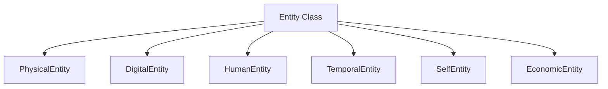

# K21-15: Domain Taxonomy & Entity Hierarchy

This document specifies the subclass inheritance tree and properties for domain-specific Entities, integrated with the Semantic Concept Layer.

---

## 1. Inheritance Hierarchy

All objects in the World Model descend from a common `Entity` class, implementing domain-specific fields:

### 1. PhysicalEntity
- Properties: `location` (coordinates/region), `dimensions`, `weight`, `power_state`.
### 2. DigitalEntity
- Properties: `file_path`, `repository_url`, `api_endpoint`, `port`, `hash`.
### 3. HumanEntity
- Properties: `name`, `role`, `trust_score`, `emotional_state`, `preferences`.
### 4. SelfEntity
- Properties: `cpu_load`, `ram_usage`, `active_agents`, `failure_rate`, `task_queue_depth`.
### 5. EconomicEntity
- Properties: `token_budget`, `cost_per_query`, `api_tier`.
### 6. TemporalEntity
- Properties: `start_time`, `duration`, `recurrence`, `next_trigger`.

---

## 2. Semantic Concept Layer

To prevent duplicating schemas across domains, a **Semantic Concept Layer** maps abstract templates:
- **Concept Template**: `Device` $\rightarrow$ properties: `ip_address`, `status`.
- **Domain Mapping**: `PhysicalEntity` can declare that it implements the `Device` concept, inheriting its property constraints and validation rules.
