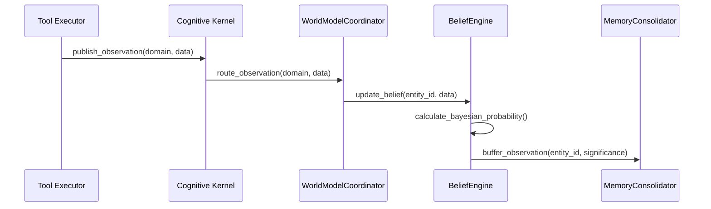
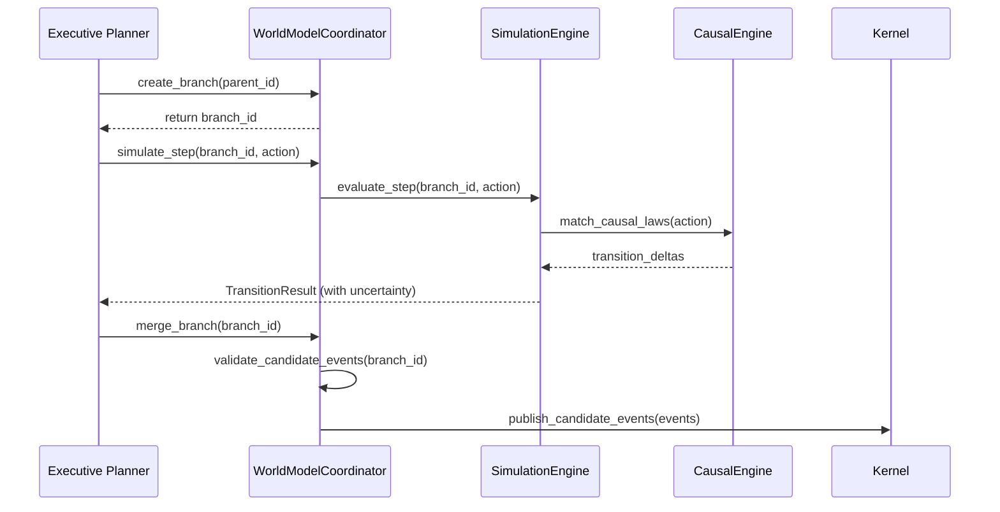

# K21-23: Sequence Diagrams Specification

This document contains sequence diagrams mapping component interactions across key pipelines.

---

## 1. Observation Pipeline

---

## 2. Simulation & Branch Merge Pipeline

