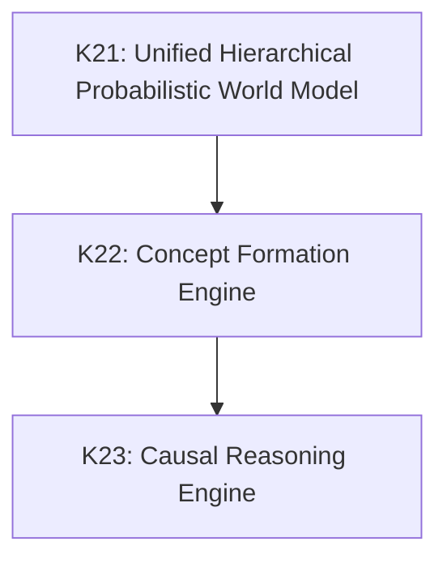

# Kattappa Research Board & Backlog

This document tracks overall capability progress, active backlogs, and milestone gates within the 20 Research Programs.

---

## 1. Capability Maturity Matrix

| Capability | Associated Program | Current Score | Target Score | Research Status |
| :--- | :--- | :--- | :--- | :--- |
| **Cognitive Core** | Program A: Cognitive Core | `████████░░ 8.0/10` | `10/10` | K20 CEO Upgrade Integrated |
| **Memory System** | Program B: Memory Systems | `█████████░ 9.0/10` | `10/10` | StagingConsolidator & KG Sync Active |
| **Prediction** | Program A: Cognitive Core | `███████░░░ 7.0/10` | `10/10` | Predictive Engine Active (K16) |
| **Learning** | Program D: Learning Algorithms | `████░░░░░░ 4.0/10` | `10/10` | Failed Example Gating Active |
| **World Model** | Program C: World Models | `██░░░░░░░░ 2.0/10` | `9/10` | Research / Design Phase |
| **Reasoning** | Program E: Reasoning Systems | `██████░░░░ 6.0/10` | `10/10` | Classifier & Scientist Engines Active |
| **Autonomy** | Program G: Autonomous Agents | `██░░░░░░░░ 2.0/10` | `9/10` | TaskScheduler Delegation Active |
| **Self Evolution** | Program H: Self Improvement | `█░░░░░░░░░ 1.0/10` | `8/10` | Backlog |
| **Research Lab** | Program N: Scientific Discovery| `██░░░░░░░░ 2.0/10` | `10/10` | Hypothesis Disproof Setup Active |
| **Alignment & Safety** | Program J: Safety & Alignment | `██████░░░░ 6.0/10` | `10/10` | Resolver & Wisdom Gating Active |

---

## 2. Active Research Backlog

### K21: Unified Hierarchical Probabilistic World Model
- **Associated Program**: `Program C: World Models`
- **Research Question**: How do we systematically structure Physical, Social, Digital, and Self domains within a dynamic simulation state?
- **Prerequisites**: `Predictive Engine (K16)`
- **Target Benchmark**: Object permanence validation $\ge 90\%$; transition forecasting accuracy $\ge 90\%$.
- **Current Pipeline Stage**: `Literature Review`
