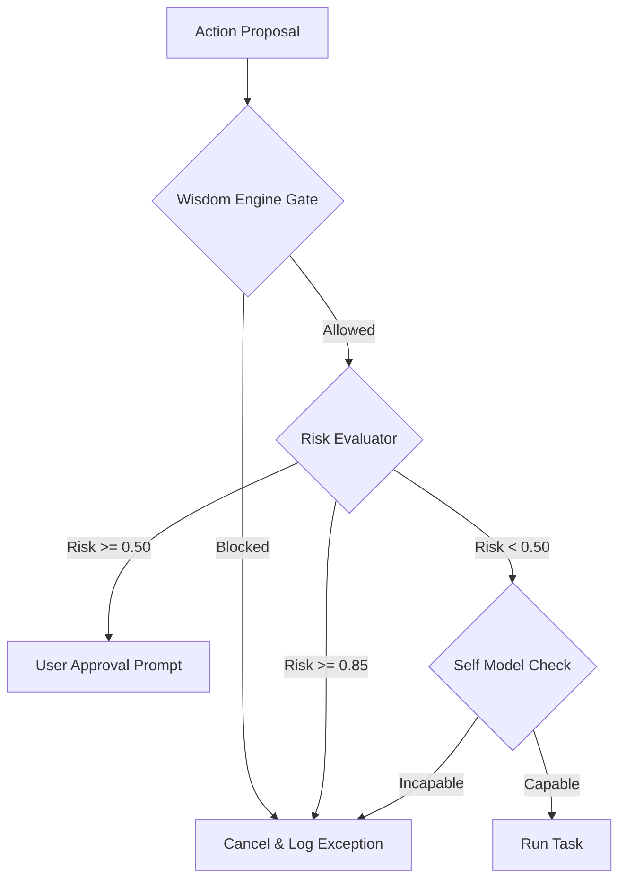

# Kattappa Safety & Alignment Specification

This document tracks safety guardrails, value alignment, and operational constraints for Kattappa.

---

## 1. Multi-Tier Gating & Overrides

Kattappa enforces safety at three distinct layers before action execution:

### Wisdom Engine Alignment Gate
- Translates core immutable values (Bhagavad Gita) into behavioral rules.
- Restricts actions involving unauthorized access, data deletion without backups, or deceptive representations.

### Risk Evaluator (World Model)
- Evaluates transition consequences.
- Risk ratings $\ge 0.85$ result in immediate plan aborts.
- Risk ratings $\ge 0.50$ halt the scheduler and prompt for explicit user approval.

### Capability Boundary check (Self Model)
- Compares query demands against active capabilities and hardware loads.
- Gracefully returns `I do not have the capability to handle this query` instead of generating hallucinations.

---

## 2. Sandbox Execution & Rollbacks

- **SQLite Transactions**: All write operations across memory layers, belief states, and temporal graphs are wrapped in ACID-compliant database transactions. In case of unexpected failures, connections immediately rollback to preserve integrity.
- **File System / API Isolation**: Tool executions occur inside bounded environment workspaces.
