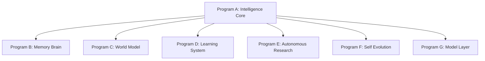

# Kattappa Vision Document

## Core Vision
Kattappa is a multi-year AGI research program designed to build a unified, continuously improving, modular Cognitive Operating System (COS). Rather than adding isolated features, Kattappa aims to systematically develop the capabilities that form the foundations of general intelligent systems.

---

## The Seven Programs

1. **Program A: Intelligence Core**: Coordinates decision-making, planning, hypothesis generation, and value alignment.
2. **Program B: Memory Brain**: Layered, persistent memory structures supporting transient workspaces, sleep buffers, and semantic knowledge graphs.
3. **Program C: World Model**: Internal simulators predicting reality transitions across Physical, Social, Digital, Self, and Economic domains.
4. **Program D: Learning System**: Lifelong feedback loop extracting patterns from successes, failures, and code execution.
5. **Program E: Autonomous Research**: automated scientist agents competing to discover new models, algorithms, and heuristics.
6. **Program F: Self Evolution**: Safe, verified, and benchmarked code modification pipelines.
7. **Program G: Model Layer**: Multi-model routing and cognitive council orchestration.
