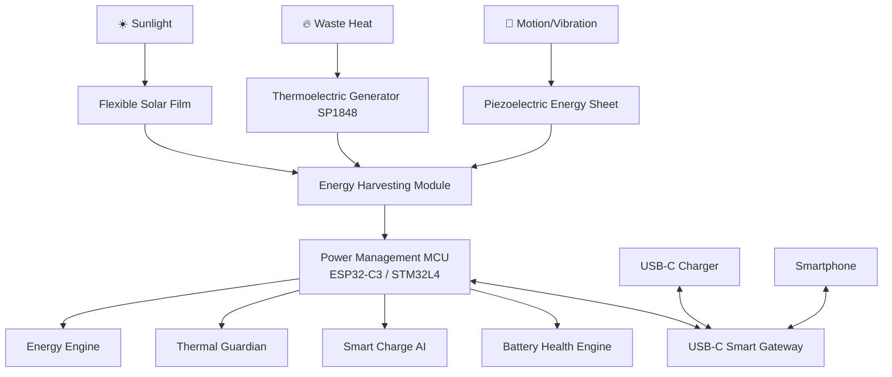

# VOLTIS: Intelligent Power Cover
> **Tagline:** *Intelligence Behind Every Charge.*

## Original Description
An intelligent smartphone back cover that harvests energy from sunlight, heat, and motion while optimizing charging, improving battery health, reducing thermal stress, and acting as a smart power gateway between chargers and mobile devices.

## Core Vision
> *A self-optimizing intelligent power cover that harvests ambient energy, protects battery health, and delivers the most efficient charge your device can safely accept.*

## System Architecture

## Hardware Design (Layer Stackup)
1. **Layer 1 (Outer Surface): Flexible Solar Film**
   - *Purpose*: Harvest sunlight, enable emergency charging, outdoor power generation.
   - *Technology*: Flexible Perovskite or Thin Film Solar Cells.
2. **Layer 2: Graphene Heat Spreader**
   - *Purpose*: Distribute heat generated by phone CPU, reduce hot spots, improve battery life.
3. **Layer 3: Thermoelectric Generator (TEG) Array**
   - *Purpose*: Recover small amounts of waste heat.
   - *Component*: TEG SP1848 or equivalent.
4. **Layer 4: Piezoelectric Energy Sheet**
   - *Purpose*: Generate electricity from movement (walking, handling, vibrations).
5. **Layer 5: Smart Controller Board**
   - *Purpose*: Main computing unit for power routing and telemetry.
   - *MCU*: ESP32-C3 (for BLE app connection) or STM32L4 (low power).
6. **Layer 6: USB-C Smart Gateway**
   - *Purpose*: Negotiate protocols, route charger/harvested power.
   - *Components*: USB PD Controller (STUSB4500 / TPS25750) and fast-charge negotiation ICs.

## Software Design (Voltis OS & Mobile App)

### Voltis OS Modules
* **Energy Engine**: Calculates and aggregates solar, heat, and motion inputs (`Solar + Heat + Motion = Total Harvested Power`).
* **Thermal Guardian**: Monitors CPU, battery, and cover temperatures; reduces charging speeds, triggers recommendations.
* **Smart Charge AI**: Detects phone capability and adjusts voltage/current to match hardware limits.
* **Battery Health Engine**: Tracks cycles, temperature history, and estimates wear.

### Mobile App Dashboard
* Live telemetry: Current power input from Solar, Heat, and Motion.
* Battery health index and temperature.
* Custom charge scheduling (e.g. limiting to 80% to preserve lifespan).

## Phased Building Procedures

### Phase 1: Energy Harvesting Proof of Concept
- Integrate ESP32-C3 with a small flexible solar panel, a TEG SP1848, and a piezoelectric disc.
- Feed harvested power into a TP4056 module to verify simple trickle-charging of a local lithium battery.

### Phase 2: Smart Charging & Negotiation Board
- Add USB-C PD controllers to negotiate power rules with chargers and target phones.
- Implement voltage and current sensing circuits to monitor input/output power.

### Phase 3: Thermal Management & Guardian OS
- Embed temperature sensors (DS18B20 / TMP117) close to the CPU contact area.
- Develop firmware protection rules to throttle charge current under high thermal stress.

### Phase 4: Mobile Application & Analytics
- Develop the BLE dashboard app.
- Program battery-health logging algorithms.

### Phase 5: Integrated Smartphone Cover Prototype
- Design and manufacture a thin flexible PCB.
- Embed components into a protective, lightweight, injection-molded back cover shell with integrated graphene layer.

## Expected Performance
* **Battery Life Extension**: +5% to +20% depending on usage and outdoor exposure.
* **Thermal Management**: Reduced hot spot temperatures by up to 5-8°C.
* **Battery Health**: Extended pack lifespan by preventing overcharging/overheating.
* **Emergency Charge**: Provides sufficient energy for emergency text messaging/calls under direct sunlight.

## Product Assessment & Feasibility
* **Originality**: ★★★★☆ — The integration of a smart charging gateway with multi-source energy harvesting is highly innovative.
* **Technical Feasibility**: ★★★★☆ — High feasibility on smart charging, thermal management, mobile telemetry, and solar. Heat and vibration harvesting provide a lesser contribution but are scientifically valid.
* **Commercial Potential**: ★★★★☆ — Directly resolves "smartphone battery anxiety" and has strong appeal to field workers, travelers, and heavy users.

## Voltis v2 Roadmap
* **Voltis Core**: Smart charging, thermal management, battery analytics.
* **Voltis Solar**: Flexible solar layer integration for outdoor charging.
* **Voltis Shield**: Surge protection, charger quality diagnostics, unsafe cable detection.
* **Voltis AI**: Learns charging habits, predicts battery degradation, recommends optimized charging schedules.
* **Voltis Mesh**: Peer-to-peer power sharing between devices (Phone ↔ Phone, Phone ↔ Accessories).

## Project Portfolio Positioning
VOLTIS stands out as a highly practical, prototype-ready project that can be built using existing components. Here is how it fits within the current ecosystem:

| Project | Domain | Motive |
| :--- | :--- | :--- |
| **Kairo** | Telekinesis/HCI | Gestural matter manipulation |
| **Prism** | Energy/Optics | Adaptive invisible protective dome shield |
| **Tempo** | Relativistic Physics | Localized temporal dilation environment |
| **Portal** | Spacetime Shortcuts | Exotic-matter wormhole teleportation |
| **Mira** | Atomic Reconstruction | Matter mapping and programmatic self-assembly |
| **DEWS** | Threat Alerting | Defensive early hazard warning systems |
| **VOLTIS** | Intelligent Power Systems | Ambient energy harvesting and smart power gateway |

